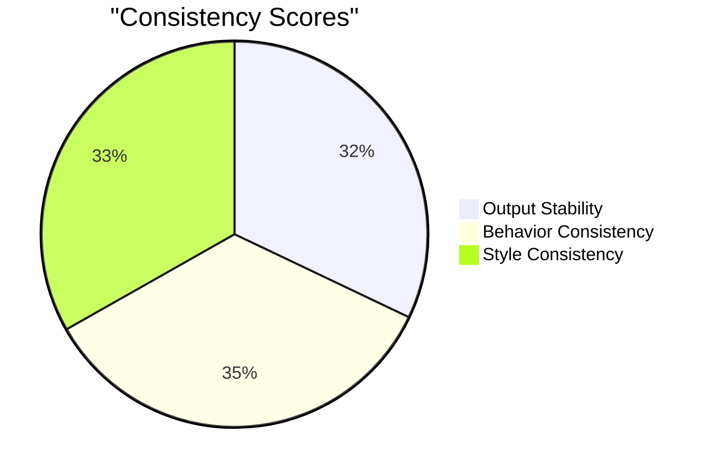

# Katalon Studio StudioAssist PoC Testing Framework

A comprehensive testing framework for evaluating and comparing different LLM implementations of Katalon Studio's StudioAssist feature.

## Overview

This framework implements a phased testing approach to evaluate and compare different LLM (Language Learning Model) implementations for Katalon Studio's StudioAssist feature. It supports:

- Baseline creation with LL1 (Phase 1)
- Target dataset creation with LL2 (Phase 2)
- Comprehensive comparison and evaluation (Phase 3)

## Reports

### Interactive Dashboard

The framework now includes an interactive web dashboard for viewing and analyzing test reports. The dashboard provides:

- Real-time metrics visualization
- Trend analysis across test runs
- Feature distribution insights
- Searchable report history

To access the dashboard:

1. **Local Development**:
   ```bash
   # Generate reports data
   python scripts/generate_reports_data.py
   
   # Open reports/index.html in your browser
   ```

2. **GitHub Pages** (if configured):
   - Visit the GitHub Pages URL for your repository
   - Reports are automatically updated on each push to main

### Latest Comparison Reports

The framework generates detailed HTML comparison reports for each evaluation run. Here are the recent reports:

<details>
<summary>Generate Code Feature (2025-05-28)</summary>

#### Report Details
- **Feature**: Generate Code
- **Date**: May 28, 2025
- **Report**: [View Full Report](reports/comparison_report_generate_code_20250528_144407.html)

#### Key Metrics Summary


#### Quick Links
- [Detailed Analysis](reports/comparison_report_generate_code_20250528_144407.html#analysis)
- [Performance Metrics](reports/comparison_report_generate_code_20250528_144407.html#performance)
- [Recommendations](reports/comparison_report_generate_code_20250528_144407.html#recommendations)

</details>

<details>
<summary>Explain Code Feature (2025-05-28)</summary>

#### Report Details
- **Feature**: Explain Code
- **Date**: May 28, 2025
- **Report**: [View Full Report](reports/comparison_report_explain_code_20250528_114756.html)

#### Key Findings
- Improved explanation clarity in LL2
- Better context understanding
- More detailed code analysis

</details>

### Accessing Reports

1. **Local Viewing**:
   ```bash
   # Open latest report in default browser
   python main.py --open-report latest
   
   # Open specific report
   python main.py --open-report reports/comparison_report_generate_code_20250528_144407.html
   ```

2. **Continuous Integration**:
   - Reports are automatically generated after each comparison phase
   - Located in the `reports/` directory
   - Named format: `comparison_report_<feature>_<timestamp>.html`

3. **Report Features**:
   - Interactive charts and visualizations
   - Detailed metric comparisons
   - Code quality analysis
   - Performance benchmarks
   - Recommendations for improvement

### Report Structure

Each HTML report includes:

1. **Executive Summary**
   - Overall comparison results
   - Key metrics and scores
   - Major findings

2. **Detailed Analysis**
   - Feature-by-feature comparison
   - Code quality metrics
   - Performance benchmarks
   - Behavioral analysis

3. **Visualizations**
   - Metric comparison charts
   - Performance graphs
   - Quality score distributions

4. **Recommendations**
   - Improvement suggestions
   - Best practices
   - Next steps

## Features

- **Phased Testing Workflow**:
  - Phase 1: Create baseline datasets using LL1
  - Phase 2: Create target datasets using LL2
  - Phase 3: Compare and evaluate results

- **Comprehensive Evaluation**:
  - Output stability analysis
  - Behavior consistency checks
  - Code quality assessment
  - Performance metrics
  - Detailed comparison reports

- **Flexible Configuration**:
  - Support for multiple LLM providers
  - Configurable through environment variables or config file
  - Feature-specific testing parameters

## Prerequisites

- Python 3.8+
- Katalon Studio Enterprise (KSE) license
- Access to LLM APIs (LL1, LL2, LL3)
- Required environment variables (see Configuration section)

## Installation

1. Clone the repository:
   ```bash
   git clone [repository-url]
   cd Katalon_Test_GenAI
   ```

2. Install dependencies:
   ```bash
   pip install -r requirements.txt
   ```

3. Set up environment variables (see Configuration section)

## Configuration

### Environment Variables

Key environment variables:

```bash
# Required
KATALON_API_KEY=your_katalon_api_key
LLM3_API_KEY=your_llm3_api_key

# Optional with defaults
KATALON_API_URL=default_url
LLM3_PROVIDER=gemini
LLM3_MODEL=gemini-pro
KATALON_VERSION=10.2.0

# LLM Configuration
LL1_CONFIG_TYPE=katalon_ai
LL1_API_KEY=your_ll1_api_key
LL1_MODEL=gpt-4o-mini

LL2_CONFIG_TYPE=personal_openai
LL2_API_KEY=your_ll2_api_key
LL2_MODEL=gpt-4o-mini
```

### Configuration File

Alternatively, create a `config.json` file:

```json
{
  "katalon_api_url": "your_api_url",
  "katalon_api_key": "your_api_key",
  "llm3_provider": "gemini",
  "llm3_api_key": "your_llm3_key",
  "feature": "generate_code",
  "kse_license": true
}
```

## Usage

### Basic Workflow

1. **Create Baseline (Phase 1)**:
   ```bash
   python main.py --feature generate_code --phase baseline
   ```

2. **Create Target (Phase 2)**:
   ```bash
   python main.py --feature generate_code --phase target
   ```

3. **Compare Results (Phase 3)**:
   ```bash
   python main.py --feature generate_code --phase compare
   ```

### Additional Commands

- Check workflow status:
  ```bash
  python main.py --feature generate_code --status
  ```

- Promote target to baseline:
  ```bash
  python main.py --feature generate_code --promote
  ```

- List available features:
  ```bash
  python main.py --list-features
  ```

### Test Modes

- **Consistency Mode**: Uses same inputs for LL1 and LL2
- **Accuracy Mode**: Uses different inputs to test adaptability

## Project Structure

```
Katalon_Test_GenAI/
├── main.py                 # Main entry point
├── config.py              # Configuration management
├── constants.py           # Constants and enums
├── phased_orchestrator.py # Core testing workflow
├── services/             # Service implementations
├── utils/               # Utility functions
└── poc_data/           # Test data directory
```

## Evaluation Criteria

The framework evaluates LLM implementations based on:

1. **Consistency Metrics**:
   - Output Stability (0-1)
   - Behavior Consistency (0-1)
   - Style Consistency (0-1)

2. **Accuracy Metrics**:
   - Functional Correctness (0-1)
   - Code Quality (0-1)
   - Test Coverage (0-1)

3. **Performance Metrics**:
   - Execution Time
   - Resource Usage
   - Response Time

## Contributing

1. Fork the repository
2. Create a feature branch
3. Commit your changes
4. Push to the branch
5. Create a Pull Request

## License

[Your License Information]

## Support

For support, please contact [Your Contact Information]
