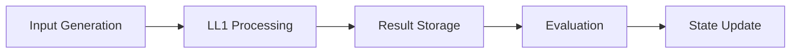
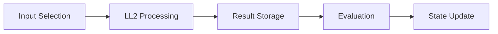

# Katalon Studio StudioAssist PoC Technical Documentation

## Table of Contents
1. [Architecture Overview](#architecture-overview)
2. [Core Components](#core-components)
3. [Data Flow](#data-flow)
4. [Implementation Details](#implementation-details)
5. [API Reference](#api-reference)
6. [Testing Framework](#testing-framework)
7. [Performance Considerations](#performance-considerations)
8. [Security Considerations](#security-considerations)
9. [Error Handling](#error-handling)
10. [Deployment Guide](#deployment-guide)

## Architecture Overview

### System Architecture
The StudioAssist PoC Testing Framework implements a three-phase architecture for evaluating LLM implementations:

```
┌─────────────────┐     ┌─────────────────┐     ┌─────────────────┐
│    Phase 1      │     │    Phase 2      │     │    Phase 3      │
│  LL1 Baseline   │────▶│  LL2 Target     │────▶│   Comparison    │
└─────────────────┘     └─────────────────┘     └─────────────────┘
```

### Key Components
- **Orchestrator**: Manages workflow execution and state
- **Configuration Manager**: Handles system configuration
- **Service Layer**: Implements core business logic
- **Evaluation Engine**: Processes and analyzes results

## Core Components

### PhasedOrchestrator
The `PhasedOrchestrator` class is the central component managing the testing workflow:

```python
class PhasedOrchestrator:
    def run_phase_1_baseline(...)  # Baseline creation
    def run_phase_2_target(...)    # Target creation
    def run_phase_3_compare(...)   # Results comparison
```

Key responsibilities:
- Workflow state management
- Phase transition handling
- Resource coordination
- Error recovery

### Configuration System
Configuration management is handled through a hierarchical system:

1. Environment Variables (highest priority)
2. Configuration File (config.json)
3. Default Values (lowest priority)

```python
@dataclass
class Config:
    katalon_api_url: str
    katalon_api_key: str
    llm3_provider: str
    # ... other fields
```

### Service Layer
The service layer implements core business logic:

1. **LLM Service**
   - API integration with different LLM providers
   - Request/response handling
   - Rate limiting and retry logic

2. **Evaluation Service**
   - Dataset comparison
   - Metric calculation
   - Report generation

## Data Flow

### Phase 1: Baseline Creation


### Phase 2: Target Creation


### Phase 3: Comparison


## Implementation Details

### State Management
The framework uses a file-based state management system:

```python
class WorkflowState:
    current_phase: str
    baselines: Dict[str, Dict]
    target_dataset: Optional[Dict]
    # ... other state fields
```

### Dataset Structure
Datasets are stored in JSON format:
```json
{
    "id": "dataset_001",
    "created_at": "ISO-8601-timestamp",
    "feature": "generate_code",
    "inputs": [...],
    "outputs": [...],
    "metrics": {
        "execution_time": float,
        "quality_score": float
    }
}
```

### Evaluation Metrics
The framework calculates various metrics:

1. **Consistency Metrics**
   ```python
   def calculate_consistency(baseline, target):
       stability = measure_output_stability(baseline, target)
       behavior = measure_behavior_consistency(baseline, target)
       style = measure_style_consistency(baseline, target)
       return ConsistencyMetrics(stability, behavior, style)
   ```

2. **Accuracy Metrics**
   ```python
   def calculate_accuracy(baseline, target):
       correctness = measure_functional_correctness(target)
       quality = measure_code_quality(target)
       coverage = measure_test_coverage(target)
       return AccuracyMetrics(correctness, quality, coverage)
   ```

## API Reference

### Main CLI Interface
```bash
python main.py [--feature FEATURE] [--phase {baseline,target,compare}]
               [--test-mode {consistency,accuracy}]
               [--num-patterns NUM] [--skip-evaluation]
```

### Configuration API
```python
def load_config(feature: Optional[str] = None) -> Config:
    """Load configuration from environment and file."""

def setup_logging(level: str = "INFO") -> logging.Logger:
    """Configure logging system."""
```

### Orchestrator API
```python
async def run_phase_1_baseline(self, num_patterns: int = 10,
                             inputs_file: Optional[str] = None,
                             skip_evaluation: bool = False) -> Dict

async def run_phase_2_target(self, test_mode: TestMode = TestMode.CONSISTENCY,
                           skip_evaluation: bool = False,
                           num_patterns: int = 10) -> Dict

async def run_phase_3_compare(self) -> Dict
```

## Testing Framework

### Unit Tests
- Located in `tests/unit/`
- Uses pytest framework
- Mocks external services

### Integration Tests
- Located in `tests/integration/`
- Tests full workflow
- Requires configuration

### Performance Tests
- Located in `tests/performance/`
- Measures execution times
- Tests concurrency handling

## Performance Considerations

### Optimization Techniques
1. **Caching**
   - Results caching
   - Configuration caching
   - State caching

2. **Concurrency**
   - Async/await patterns
   - Concurrent API calls
   - Resource pooling

3. **Resource Management**
   - Connection pooling
   - Memory management
   - File handle management

## Security Considerations

### API Key Management
- Environment variables
- Secure configuration
- Key rotation support

### Data Protection
- Secure storage
- Access control
- Encryption support

### Error Handling
- Rate limiting
- Retry mechanisms
- Graceful degradation

## Error Handling

### Error Types
1. **Configuration Errors**
   - Missing API keys
   - Invalid configuration
   - File access issues

2. **Runtime Errors**
   - API failures
   - Network issues
   - Resource constraints

3. **Data Errors**
   - Invalid input
   - Corrupt state
   - Inconsistent data

### Recovery Mechanisms
```python
try:
    await orchestrator.run_phase()
except ConfigError:
    # Handle configuration issues
except APIError:
    # Handle API failures
except StateError:
    # Handle state corruption
```

## Deployment Guide

### Prerequisites
- Python 3.8+
- Virtual environment
- Required API keys

### Installation Steps
1. Environment Setup
   ```bash
   python -m venv venv
   source venv/bin/activate  # Unix
   pip install -r requirements.txt
   ```

2. Configuration
   ```bash
   cp .env.example .env
   # Edit .env with your values
   ```

3. Verification
   ```bash
   python main.py --feature generate_code --status
   ```

### Monitoring
- Log file locations
- Metrics collection
- Alert configuration

### Maintenance
- Backup procedures
- Update process
- Troubleshooting guide 